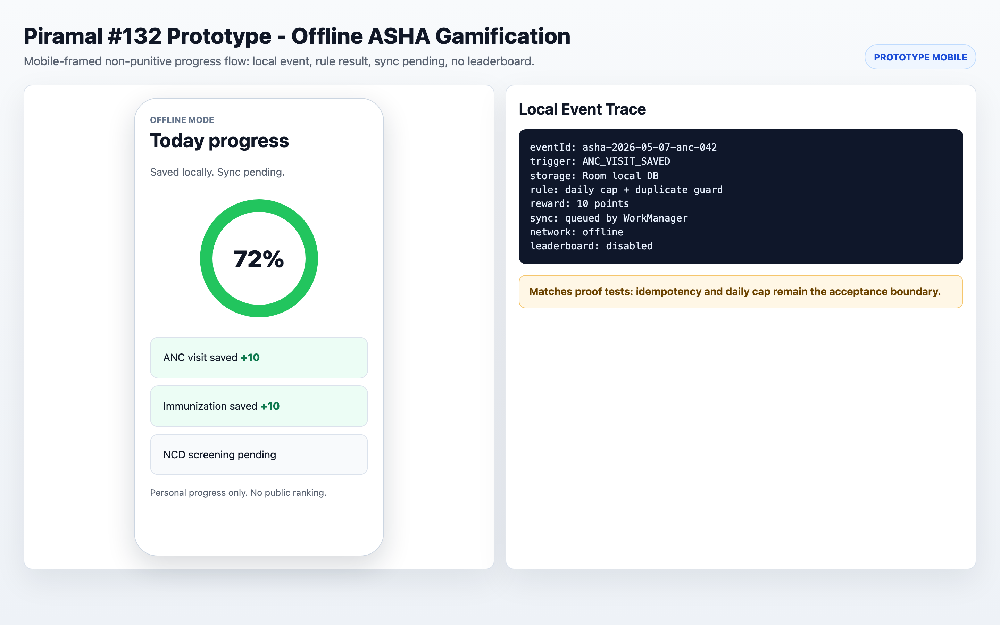
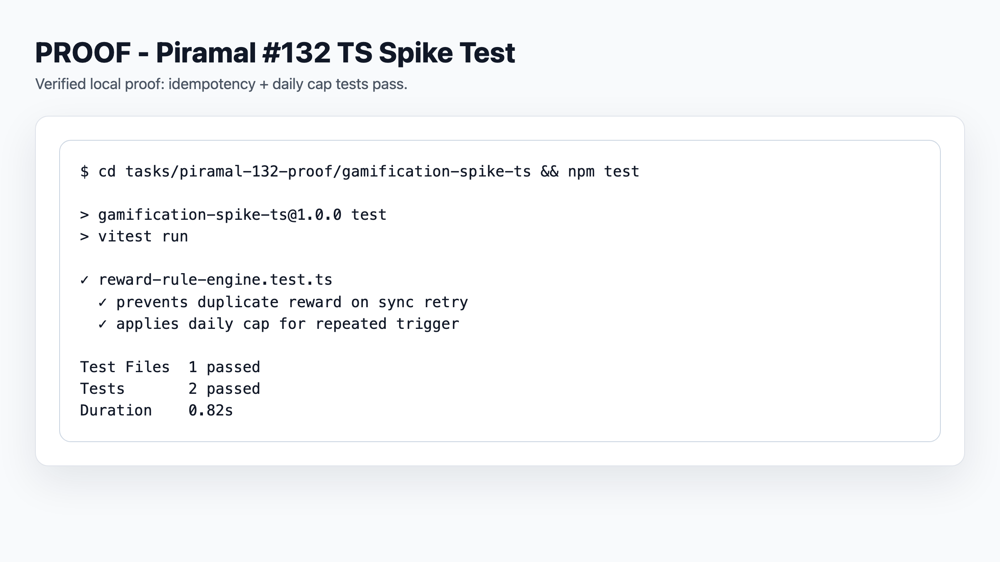
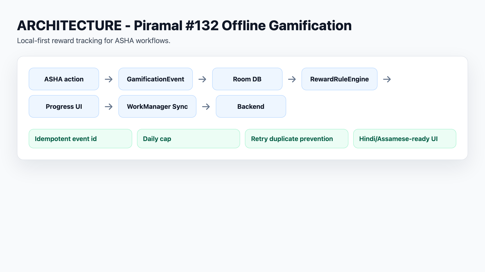

# Piramal #132 Proof Packet

Status: proposal-facing proof packet. It is based on live source inspection of `PSMRI/FLW-Mobile-App` at commit `6df8b9b4` on `main`.

This packet supports the C4GT DMP 2026 proposal for [PSMRI/AMRIT #132](https://github.com/PSMRI/AMRIT/issues/132), the FLW Mobile App gamification module for ASHA workers.

## Evidence Index

| Artifact | What it proves | Status |
| --- | --- | --- |
| `OFFLINE_ARCH.md` | Visual: offline data flow + dashboard wireframe | Completed |
| `source-audit.md` | The proposal is grounded in current FLW Mobile App source: Room, WorkManager, Hilt, workflows, localization, tests, and incentives. | Completed |
| `trigger-map.md` | The first gamification triggers are tied to real health-worker workflows, not generic app usage. | Completed |
| `gamification-schema.md` | Offline event, reward rule, worker progress, and sync state model. | Completed |
| `architecture-note.md` | How the module fits Room, SQLCipher, Repository/Hilt, WorkManager, Firebase, and localized UI. | Completed |
| `validation-matrix.md` | How to test duplicate prevention, offline behavior, localization, performance, and anti-gaming. | Completed |
| `progress-widget-sketch.md` | Lightweight proposal sketch for the first UI surface. | Completed |
| `gamification-spike-ts/` | Executable rule-engine spike proving duplicate-event idempotency and daily-cap enforcement. | Completed |
| `android-native-proof/` | Kotlin-shaped proof slice for `GamificationEvent`, duplicate prevention, daily cap, and pending sync state. | Completed |
| `android-native-proof/jvm-rule-engine-test/` | JVM Kotlin proof with 4 passing tests for event deduping, daily cap, offline sync, stable reward ID. | **NEW 2026-05-07** |

## Proof Boundary

Completed now:

- issue audit;
- live repository clone;
- source audit with file and line citations;
- proposed data model and trigger map;
- architecture and validation notes;
- proposal-facing UI sketch.

Not completed now:

- Android Studio build;
- upstream code patch;
- running app screenshot;
- mentor-approved final mechanic.

Build verification note:

- `./gradlew :app:assembleDebug` was attempted in FLW clone after wrapper update to Gradle 8.9.
- Current blocker is environment-level: Android SDK path is missing on this machine, so assemble cannot proceed yet.

The packet is meant to show product and architecture judgement before submission. It does not claim the gamification feature has already been implemented.

<!-- C4GT_VISUAL_SCREENSHOTS_START -->
## Visual Proof Screenshots

Generated reviewer-facing PNGs. Runtime/prototype screenshots lead each project; architecture and proof tables remain supporting evidence. Prototype images do not expand the verified implementation boundary.

### Prototype mobile proof: offline ASHA gamification progress, local event, sync pending.

Path: `screenshots/prototype-asha-offline-gamification.png`

### Terminal proof: TS gamification spike tests pass.

Path: `screenshots/gamification-test-pass.png`

### Offline architecture: ASHA action -> local event -> Room -> rule engine -> UI -> sync.

Path: `screenshots/offline-gamification-architecture.png`
<!-- C4GT_VISUAL_SCREENSHOTS_END -->
